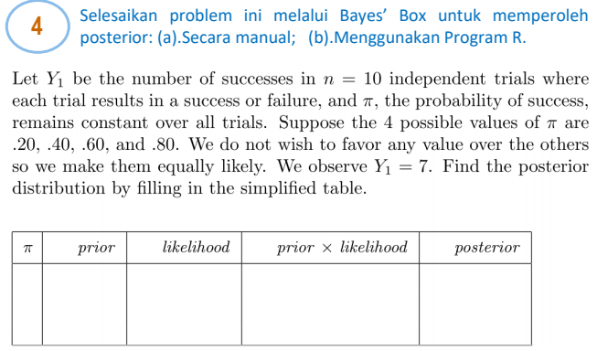

# Pertemuan 2

## Responsi

### No 1

{width="536"}

> **Misal**
>
> -   D : Disease
>
> -   T : Positive

> **Diketahui :**
>
> -   Sensitivitas = 0.95 ➡️ $\frac{TP}{TP+FN}$ ➡️ "Punya disease (D), dan test positive (T)" ➡️ $P(T|D)$
>
> -   Spesifisitas = 0.9 ➡️ "Gak punya disease ($D^c$) dan test nya negative ($T^c$) ➡️ $P(T^c|D^c)$
>
> -   $P(D)$ = 0.01

$P(D|T) = \frac{P(T|D) P(D)}{P(T)}$

Menggunakan kaidah peluang total :

$\begin{equation}\begin{aligned} P(T) &= P(T|D) P(D) + P(T|D^c) P(D^c) \\ &= 0.95 (0.01) + 0.1 (0.99) \\ &= 0.0095 + 0.099 \end{aligned}\end{equation}$

$\begin{equation}\begin{aligned} P(D|T) &= \frac{0.0095} {0.0095+0.0099} \\ &= 0.087 \end{aligned}\end{equation}$

|       | D              | $D^c$          |
|-------|----------------|----------------|
| T     | True Positive  | False Positive |
| $T^2$ | False Positive | True Negative  |

### No 2

{width="474"}

> **Diketahui :**
>
> -   Sensitivitas = 0.9 ➡️ $\frac{TP}{TP+FN}$ ➡️ "Screening positif (A) dan punya kanker (B)" ➡️ $P(A|B)$
>
> -   Spesifisitas = 0.95 ➡️ "Screening negatif ( $A^c$) dan gak kanker ($B^c$)" ➡️ $P(A^c|B^c)$
>
> -   $P(B)$ = 0.001

> **Poin a**

$P(B|A) = \frac{P(A|B) P(B)}{P(A)}$

Menggunakan kaidah peluang total :

$\begin{equation}\begin{aligned} P(A) &= P(A|B) P(B) + P(A|B^c) P(B^c) \\ &= 0.9 (0.001) + 0.05 (0.999) \\ &= 0.0009 + 0. \end{aligned}\end{equation}$

$\begin{equation}\begin{aligned} P(D|T) &= \frac{0.0009} {0.05085} \\ &= 0.01769 \end{aligned}\end{equation}$

> **Poin b**

Tidak efektif, karena nilai peluang nya kecil.

### No 4

{width="488"}

$Y_1 \sim \text{Binom}(10, \pi)$, dengan $\pi = 0.2, 0.4, 0.6, 0.8$

$P(Y_1=y_1)=\binom{n}{y_1} \pi^y_1 (1-\pi)$

| $\pi$ | Prior | Likelihood | Prior $\times$ Likelihood | Posterior |
|:-----:|:-----:|------------|---------------------------|-----------|
|  0.2  |  1/4  | 0.000786   | 0.000197                  | 0.001711  |
|  0.4  |  1/4  | 0.042467   | 0.010617                  | 0.092406  |
|  0.6  |  1/4  | 0.214991   | 0.053748                  | 0.467807  |
|  0.8  |  1/4  | 0.201327   | 0.050332                  | 0.438075  |
| Total |       |            | 0.114893                  |           |

### No 14

Let $n$ be the unknown number of customers that visit a store on the day of a sale. The number of customers that make a purchase is $Y|n \sim \text{Binomial}(n, \theta)$ where \\theta is the known probability of making a purchase given the customer visited the store. The prior is $n \sim \text{Poisson}(5)$. Assuming $\theta$ is known and n is the unknown parameter, plot the posterior distribution of n for all combinations of $Y \in \{0, 5, 10 \}$ and $\theta \in \{0.2, 0.5 \}$ and comment on the effect of $Y$ and $\theta$ on the posterior.

> **Diketahui**
>
> -   $Y \sim \text{Binomial}(n, \theta)$
>
> -   $n \sim \text{Poisson}(5)$
>
> -   $Y \in \{0, 5, 10 \}$
>
> -   $\theta \in \{0.2, 0.5 \}$
>
> -   $n|y$ ?

### No 15

Last spring your lab planted ten seedlings and two survived the winter. Let $\theta$ be the probability that a seedling survives the winter.

(a) Assuming a uniform prior distribution of $\theta$, compute its posterior mean and standard deviaton.

(b) Assuming the same prior as in (a), compute and compare the equal-tailed and highest density 95% posterior credible intervals.

(c) If you plant another 10 seedlings next year, what is the posterior predictive probabilty that at least one will survive the winter?
