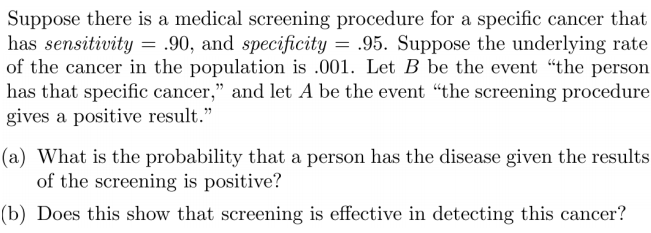

# Pertemuan 2

## Responsi

### No 1

{width="536"}

> **Misal**
>
> -   D : Disease
>
> -   T : Positive

> **Diketahui :**
>
> -   Sensitivitas = 0.95 ➡️ $\frac{TP}{TP+FN}$ ➡️ "Punya disease (D), dan test positive (T)" ➡️ $P(T|D)$
>
> -   Spesifisitas = 0.9 ➡️ "Gak punya disease ($D^c$) dan test nya negative ($T^c$) ➡️ $P(T^c|D^c)$
>
> -   $P(D)$ = 0.01

$P(D|T) = \frac{P(T|D) P(D)}{P(T)}$

Menggunakan kaidah peluang total :

$\begin{equation}\begin{aligned} P(T) &= P(T|D) P(D) + P(T|D^c) P(D^c) \\ &= 0.95 (0.01) + 0.1 (0.99) \\ &= 0.0095 + 0.099 \end{aligned}\end{equation}$

$\begin{equation}\begin{aligned} P(D|T) &= \frac{0.0095} {0.0095+0.0099} \\ &= 0.087 \end{aligned}\end{equation}$

|       | D              | $D^c$          |
|-------|----------------|----------------|
| T     | True Positive  | False Positive |
| $T^2$ | False Positive | True Negative  |

### No 2

{width="474"}

> **Diketahui :**
>
> -   Sensitivitas = 0.9 ➡️ $\frac{TP}{TP+FN}$ ➡️ "Screening positif (A) dan punya kanker (B)" ➡️ $P(A|B)$
>
> -   Spesifisitas = 0.95 ➡️ "Screening negatif ( $A^c$) dan gak kanker ($B^c$)" ➡️ $P(A^c|B^c)$
>
> -   $P(B)$ = 0.001

> **Poin a**

$P(B|A) = \frac{P(A|B) P(B)}{P(A)}$

Menggunakan kaidah peluang total :

$\begin{equation}\begin{aligned} P(A) &= P(A|B) P(B) + P(A|B^c) P(B^c) \\ &= 0.9 (0.001) + 0.05 (0.999) \\ &= 0.0009 + 0. \end{aligned}\end{equation}$

$\begin{equation}\begin{aligned} P(D|T) &= \frac{0.0009} {0.05085} \\ &= 0.01769 \end{aligned}\end{equation}$

> **Poin b**

Tidak efektif, karena nilai peluang nya kecil.
