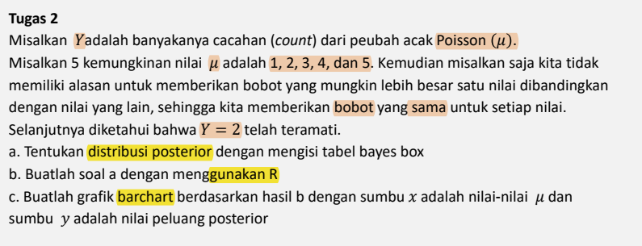

```{r message=FALSE, warning=FALSE, include=FALSE}
#                      -=( Install & Load Package Function )=-
install_load <- function (package1, ...)  {   

   # convert arguments to vector
   packages <- c(package1, ...)

   # start loop to determine if each package is installed
   for(package in packages){

       # if package is installed locally, load
       if(package %in% rownames(installed.packages()))
          do.call('library', list(package))

       # if package is not installed locally, download, then load
       else {
          install.packages(package)
          do.call("library", list(package))
       }
   } 
}

#Path Function
path <- function(){
  gsub  ( "\\\\",  "/",  readClipboard ()  )
}
#Copy path, Panggil function di console
#Copy r path, paste ke var yang diinginkan
```

# No 1

{width="619"}

> **Misalkan**
>
> -   `D` : Dena menyukai sebuah restoran
>
> -   `B5` : Restoran rating bintang 5 di OKfood
>
> -   `B4` : Restoran rating bintang 4 di OKfood
>
> -   `Bk` : Restoran rating bintang kurang dari 4 di OKfood

> **Diketahui**
>
> -   $P(D)=0.7$
>
> -   $P(B5|D)=0.2$
>
> -   $P(B4|D)=0.5$
>
> -   $P(Bk|D)=0.3$

> **Ditanya:** $P(D|Bk)$ ?

## Penyelesaian

Menggunakan **rumus bayes,**

$P(B_j|A) = \frac{P(A|B_j) \times P(B_j)} {P(A)}$, dimana $P(A)=\sum^k_{i=1} P(A|B_i) \times P(B_i)$

Maka,

$P(D|Bk) = \frac{P(Bk|D) \times P(D)} {P(Bk)} = \frac{0.3 \times 0.7} {P(Bk)}$

Dimana, $\begin{equation}\begin{aligned} P(Bk) &= P(Bk|D) \times P(D) \text{ } + \text{ } P(Bk|D^c) \times P(D^c) \\ &= (0.3 \times 0.7) \text{ } + \text{ } P(Bk|D^c) \times 0.3 \end{aligned}\end{equation}$

Bisa dilihat bahwa <mark style="background-color: #b6f2b6">informasi tambahan</mark> yang diperlukan apabila kita ingin mencari nilai $P(D|Bk)$ (Peluang Dena menyukai resto rating kurang dari 4) <mark style="background-color: #b6f2b6">adalah $P(Bk|D^c)$ (Persentase resto rating kurang dari 4 yang tidak disukai Dena).</mark>

# No 2

{width="577"}
