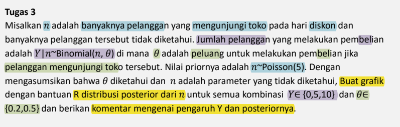

```{r message=FALSE, warning=FALSE, include=FALSE}
#                      -=( Install & Load Package Function )=-
install_load <- function (package1, ...)  {   

   # convert arguments to vector
   packages <- c(package1, ...)

   # start loop to determine if each package is installed
   for(package in packages){

       # if package is installed locally, load
       if(package %in% rownames(installed.packages()))
          do.call('library', list(package))

       # if package is not installed locally, download, then load
       else {
          install.packages(package)
          do.call("library", list(package))
       }
   } 
}

install_load("DT","dplyr","ggplot2","gridExtra")

theme1.1 <- list(
  geom_hline(yintercept = 0, size = 1, colour="#333333"),
  theme(axis.text.x = element_text(angle = 45, hjust = 1, 
                                   margin = margin(b = 10, t=-20)),
        axis.text.y = element_text(vjust = 0.5, face = "bold", 
                                   margin = margin(l = 20, r = 0)),
        plot.title = element_text(hjust = 0.5, face = "bold"),
        text = element_text(size = 30),
        plot.subtitle = element_text(hjust = 0.5),
        panel.background = element_rect(fill = 'transparent'),
        plot.background = element_rect(fill='transparent', color=NA),
        panel.grid.major = element_blank(),
        panel.grid.minor = element_blank()
        ) 
)
```

> -   <mark style="background-color: #91CCDB">**Code/Syntax :** [File.rmd](https://github.com/Zen-Rofiqy/STA1312-PSB/blob/main/Project/Tugas%20Prak%201%20Pert%201/G1401211006_Angga-Fathan-Rofiqy_Tugas-Praktikum-1.Rmd) </mark>

# No 1

{width="619"}

> **Misalkan**
>
> -   `D` : Dena menyukai sebuah restoran
>
> -   `B5` : Restoran rating bintang 5 di OKfood
>
> -   `B4` : Restoran rating bintang 4 di OKfood
>
> -   `Bk` : Restoran rating bintang kurang dari 4 di OKfood

> **Diketahui**
>
> -   $P(D)=0.7$
>
> -   $P(B5|D)=0.2$
>
> -   $P(B4|D)=0.5$
>
> -   $P(Bk|D)=0.3$

> **Ditanya:** $P(D|Bk)$ ?

## Penyelesaian

Menggunakan **rumus bayes,**

$P(B_j|A) = \frac{P(A|B_j) \times P(B_j)} {P(A)}$, dimana $P(A)=\sum^k_{i=1} P(A|B_i) \times P(B_i)$

Maka,

$P(D|Bk) = \frac{P(Bk|D) \times P(D)} {P(Bk)} = \frac{0.3 \times 0.7} {P(Bk)}$

Dimana, $\begin{equation}\begin{aligned} P(Bk) &= P(Bk|D) \times P(D) \text{ } + \text{ } P(Bk|D^c) \times P(D^c) \\ &= (0.3 \times 0.7) \text{ } + \text{ } P(Bk|D^c) \times 0.3 \end{aligned}\end{equation}$

Bisa dilihat bahwa <mark style="background-color: #b6f2b6">informasi tambahan</mark> yang diperlukan apabila kita ingin mencari nilai $P(D|Bk)$ (Peluang Dena menyukai resto rating kurang dari 4) <mark style="background-color: #b6f2b6">adalah $P(Bk|D^c)$ (Persentase resto rating kurang dari 4 yang tidak disukai Dena).</mark>

# No 2

{width="577"}

## Poin a

Likelihood sebaran Poisson dengan $Y=2$ :

$$
P(Y=2|\mu)=\frac{e^{-\mu}\mu^2}{2!} \text{ , } \mu=1,2,3,4,5
$$

Karena setiap nilai memiliki bobot yang sama, maka untuk setiap $\mu$ prior nya sama. Sehingga :

$$
P(Y=2)=\frac{1}{5} \text{ , } \mu
$$

> <mark style="background-color: #b6f2b6">Tabel bayes box</mark>

| $\mu$ | Prior | Likelihood | Prior $\times$ Likelihood | Posterior |
|:-----:|:-----:|------------|---------------------------|-----------|
|   1   |  1/5  | 0.1839     | 0.0368                    | 0.2023    |
|   2   |  1/5  | 0.2707     | 0.0541                    | 0.2976    |
|   3   |  1/5  | 0.2240     | 0.0448                    | 0.2464    |
|   4   |  1/5  | 0.1465     | 0.0293                    | 0.1611    |
|   5   |  1/5  | 0.0842     | 0.0168                    | 0.0926    |
| Total |       |            | 0.1819                    |           |

## Poin b

```{r}
# Nilai 𝜇 yang mungkin
mu <- c(1,2,3,4,5)
k <- 2 # Y=2
w <- 0 # Bobot nya sama

# Sebaran Poisson
pois.llh <- function(k, mu) return(dpois(k, mu))

post.dist <- function(k, mu, w){
  # Prior untuk setiap nilai 𝜇
  pri <- ifelse(w == 0, rep(1/length(mu), length(mu)), w)
  
  # Menghitung likelihood untuk Y=2 untuk setiap nilai 𝜇
  llh <- sapply(mu, pois.llh, k=k)
  
  # Menghitung Prior x likelihood
  pri.llh <- llh * pri
  
  # Menghitung Posterior
  post <- pri.llh / sum(pri.llh) 
  
  data.frame( mu, pri, llh, pri.llh, post ) %>% return()
}

bayes.box <- post.dist(k, mu, w) 
colnames(bayes.box) <- c("mu", "Prior", "Likelihood", "Prior x Likelihood", "Posterior")
bayes.box %>% datatable %>% 
  formatRound(c(3,4,5), digits = 4)
```

## Poin c

```{r dpi=300, fig.height = 14, fig.width = 20, message = FALSE, warning=FALSE}

ggplot(bayes.box[,c(1,5)], aes(x=factor(mu), y=Posterior)) +
  geom_bar(stat="identity", col=NA,
           fill= ifelse(bayes.box[,c(1,5)]$mu == 2,  "#1380A1", "#dddddd")) +
  labs(x = "\nNilai µ", y = "Peluang Posterior", 
       title = "\nSebaran Posterior untuk Y = 2\n") +
  theme1.1
```

# No 3

{width="632"}

> **Diketahui**
>
> -   `n` : banyaknya pelanggaan yang dateng ke toko pas hari diskon, $n \sim Poisson(5)$
>
> -   `Y` : jumlah pelanggan yang beli, $Y|n \sim Binomial(n, \theta)$, dimana $Y \in \{0,5,10\}$
>
> -   $\theta$ : peluang beli jika pelanggan dateng ke toko, $\theta \in \{0.2,0.5\}$

## Penyelesaian

Sebaran posterior dihitung untuk setiap kombinasi $Y$ dan $\theta$, yakni $\binom{4}{2}=6$, sehingga akan ada **6 grafik**.

```{r dpi=300, fig.height = 28, fig.width = 40, message = FALSE, warning=FALSE}
# Fungsi untuk menghitung distribusi posterior dari n
post.n <- function(y, theta, lamb.pois, n){
  # Menghitung prior Poisson
  pri <- dpois(n, lamb.pois)
  
  # Menghitung lilelihood Binomial P(Y|n, theta)
  llh <- dbinom(y, n, theta)
  
  # Menghitung posterior tidak ternomalisasi
  pri.llh <- pri * llh
  
  # Posterior
  post <- pri.llh / sum(pri.llh)
  return(post)
}

# Nilai-nilai yang mungkin untuk n
n.val <- 0:30

# Kombinasi nilai Y dan theta yang diberikan
Y.val <- c(0, 5, 10)
theta.val <- c(0.2, 0.5)

# Menghitung dan memplot distribusi posterior untuk semua kombinasi Y dan theta
post.plot <- function(Y.val, theta.val, n.val, lamb.pois){
  plot.list <- list()
  for(y in Y.val){
    for(theta in theta.val){
      post <- post.n(y, theta, lamb.pois, n.val)
      df <- data.frame(n=n.val, post=post)
      
      #Chart
      bar.max <- which(df$post == max(df$post))
      chart <- ggplot(df, aes(x=n, y=post)) +
        geom_bar(stat="identity", col=NA,
                 fill= ifelse(df$n %in% (bar.max-1),  "#1380A1", "#dddddd")) +
        labs(x = "\nn", y = "\nPeluang Posterior", 
             title = paste0("\nSebaran Posterior n (Y=",y, ", \u03b8=", theta, ")")) +
        theme1.1
      plot.list[[paste0("Y=", y, "\u03b8=", theta)]] <- chart
    }
  }
  return(plot.list)
}

# Asumsikan lambda untuk distribusi Poisson adalah 5
lamb.pois <- 5

# Plot/Chart
chart <- post.plot(Y.val, theta.val, n.val, lamb.pois)
do.call("grid.arrange", c(chart, ncol=2))
```

Dari chart di atas, terlihat bahwa nilai $Y$ dan $\theta$ memperngaruhi sebaran posterior, yaitu:

-   Ketika <mark style="background-color: #b6f2b6">nilai $Y$ **kecil**</mark>, misalkan saat $Y=0$, sebaran posterior cenderung berepusat di nilai <mark style="background-color: #b6f2b6"> $n$ yang **lebih kecil**</mark>. \
    Hal ini menunjukkan <mark style="background-color: #b6f2b6">jika **sangat sedikit** pelanggan yang membel`i</mark>`{=html} ($Y$), kemungkinan banyaknya <mark style="background-color: #b6f2b6">pelanggan yang dateng ke toko pada hari diskon ($n$) juga **akan sediki**`t</mark>`{=html}.

-   Sebaliknya, ketika <mark style="background-color: #b6f2b6">nilai $Y$ **besar**</mark>, sebaran posterior cenderung berpusat di nilai <mark style="background-color: #b6f2b6"> $n$ yang **lebih besar**</mark>. Ini berarti <mark style="background-color: #b6f2b6">jika **banyak** pelanggan yang membeli</mark> ($Y$), kemungkinan banyaknya <mark style="background-color: #b6f2b6">pelanggan yang dateng ke toko pada hari diskon ($n$) juga **akan lebih banyak**</mark>.

-   Sementara <mark style="background-color: #b6f2b6">nilai $\theta$ yang **lebih besar**</mark>, misalkan saat $\theta=0.5$ cenderung membuat <mark style="background-color: #b6f2b6">nilai $n$ yang **lebih besar**</mark> dibandingkan saat $\theta=0.2$. Hal ini menunjukkan saat <mark style="background-color: #b6f2b6">peluang untuk membeli jika pelanggan dateng ke toko ($\theta$) **lebih tinggi**, sebaran posterior akan menunjukkan peluang yang **lebih tinggi** untuk nilai n.</mark>

Sehingga dapat disimpulkan bahwa banyaknya pelanggan yang membeli ($Y$) dan peluang untuk membeli jika pelanggan dateng ke toko ($\theta$) memberikan **informasi penting** terkait banyaknya pelanggan yang dateng ke toko pada hari diskon yang tercermin dalam sebaran posterior dari $n$.
